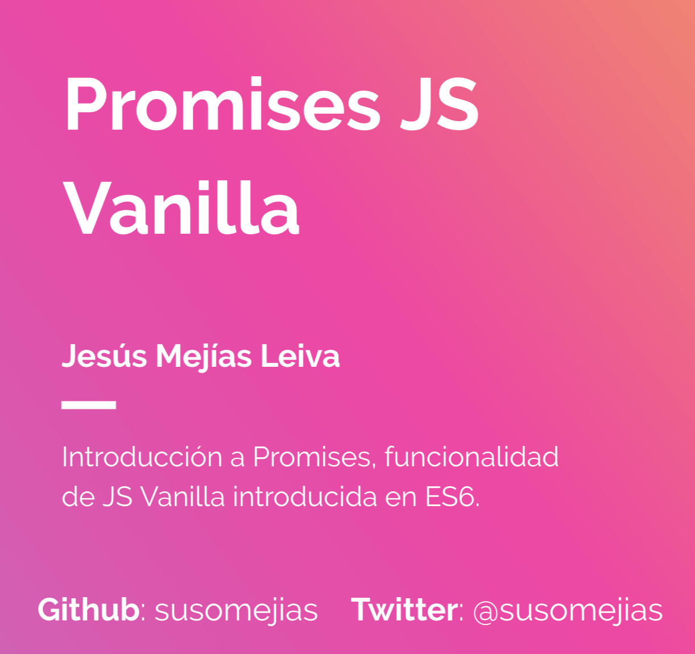

Introducción al uso de Promises Js Vanilla
---

Introducción al uso de **Promises en JS Vanilla**. Esta funcionalidad fue incluida en la **versión 6 de ECMASCRIPT**, con la idea de facilitar el uso de la **asincronía en JS Vanilla**.

Recursos
---

**Presentación:** [PromisesES6](https://view.genial.ly/5c5ece8f4e10564933dfaff9)